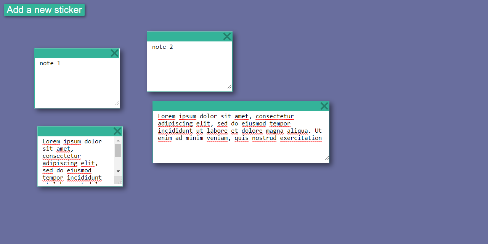

## Description

It is a Create, Read, Update and Delete (CRUD) sticky notes app written in React and using json-server for server mockup. It allows resizing of sticky notes thanks to textarea properties. It was inspired by a [YouTube tutorial](https://www.youtube.com/watch?v=dMQIVfY9hXc) from [koduje](https://www.youtube.com/channel/UCLLdzVN9P9lV8kmJhHsiuHA) channel where similar app is made in vanilla JS, without database support.



## How to use

Clone this repo

Install JSON Server 

```bash
npm install -g json-server
```

Start JSON Server

```bash
json-server --watch db.json
```
Open `index.html` and make some changes :) All will be saved in real time in `db.json`
